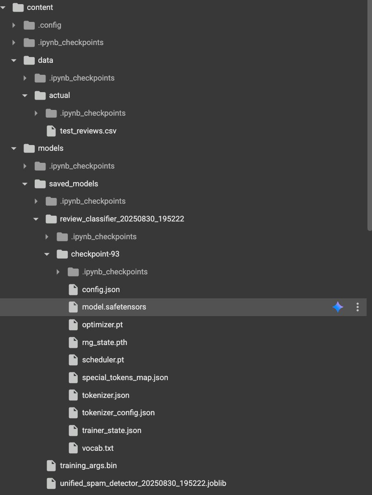

# Review Classification Pipeline

A machine learning system for automatically detecting policy violations in Google reviews using advanced natural language processing techniques.

## Project Overview

This project implements a comprehensive review classification pipeline designed to identify and categorize policy violations in user-generated review content. The system combines multiple machine learning approaches including transformer models, ensemble methods, and pseudo-labeling techniques to achieve high accuracy in content moderation.

### Key Capabilities

- **Multi-category Policy Detection**: Identifies No_Ads, Irrelevant, Rant_No_Visit violations
- **Ensemble Classification**: Combines multiple model approaches for optimal performance
- **Pseudo-labeling System**: Generates high-quality training data using Google Gemini API
- **Production-Ready Pipeline**: Complete training and inference workflow
- **Comprehensive Evaluation**: Detailed performance metrics and analysis

### Technical Architecture

The pipeline consists of two main phases:

1. **Training Phase** (`00_colab_complete_pipeline.ipynb`): Environment setup, data processing, pseudo-labeling, model training, and evaluation
2. **Inference Phase** (`01_inference_pipeline.ipynb`): Production deployment for processing new review data

## Setup Instructions

### Google Colab Setup

Google Colab provides the simplest way to run this pipeline with zero local configuration required.

#### Prerequisites

- Google account for Colab access
- Gemini API key (for pseudo-labeling features)

### Setup Steps for Evaluation / Testing Model

1. **Open the Inference Notebook**
   - Navigate to [Google Colab](https://colab.research.google.com/)
   - Open a Notebook, select "Github" and key in this repository's [URL](https://github.com/tathan08/review-rater.git)
   - Upload [`01_inference_pipeline.ipynb`](https://github.com/tathan08/review-rater/blob/main/notebooks/01_inference_pipeline.ipynb)

2. **Upload Data and Models**
   - Download locally the entire folder from [our Google Drive](https://drive.google.com/drive/folders/18Quq2TdpINtoCb7dYonyJW2hlk_5CD3e?usp=drive_link)
   - Navigate to models/saved_models and **unzip the review_classifier_195222_checkpoint93.zip**, renaming the output folder to "checkpoint93". Your file directory should look like this. 
   - Replace (drag-and-drop) the models/ and data/ folder in Google Colab with your local files
   - We have done this due to Github's limit on file size and for ease of use with Google Colab

3. **Upload Evaluation Data**
   - Place your evaluation data (the Google Reviews you want to classify) into data/actual
   - Your files should only be in .csv or .json
   - The files should only contain 2 columns, **id** and **text**

4. **Execute the Pipeline**
   - Run all cells in sequence
   - The notebook automatically handles package installation and environment setup
   - All dependencies are pre-configured for the Colab environment

5. **Review the Results**
   - Classification results are displayed in the final cell with detailed analysis
   - Results are automatically saved to `results/inference/inference_results_TIMESTAMP.csv`
   - Summary report is saved to `results/inference/summary_report_TIMESTAMP.json`
   - Download the CSV file from Colab to view complete results locally
   - The notebook displays approval/rejection statistics and policy violation categories

### Setup Steps for Pseudo-labelling and Training Model

1. **Open the Training Notebook**
   - Navigate to [Google Colab](https://colab.research.google.com/)
   - Open a Notebook, select "Github" and key in this repository's [URL](https://github.com/tathan08/review-rater.git)
   - Upload [`00_colab_complete_pipeline.ipynb`](https://github.com/tathan08/review-rater/blob/main/notebooks/00_colab_complete_pipeline.ipynb)

2. **(Optional) Upload Pre-labelled Pseudo-label and Clean Data**
   - Download locally the **data/** directory from [our Google Drive](https://drive.google.com/drive/folders/18Quq2TdpINtoCb7dYonyJW2hlk_5CD3e?usp=drive_link)
   - Upload (drag-and-drop) the **data/** folder into Google Colab.

3. **Execute the Pipeline**
   - Run all cells in sequence
   - The notebook automatically handles package installation and environment setup
   - All dependencies are pre-configured for the Colab environment
   - After training, models are saved in models/saved_models for use later on

## How to Reproduce Results

### Training Pipeline Execution

The complete training pipeline can be executed through the Colab notebook with the following workflow:

#### Phase 1: Environment and Data Setup

```python
# - Package installation and GPU configuration
# - Directory structure creation
# - Sample data loading and validation
```

#### Phase 2: Model Training and Pseudo-labeling

```python
# - HuggingFace model configuration
# - Gemini pseudo-labeling with checkpoint system
# - Training data preparation and model fine-tuning
```

#### Phase 3: Evaluation and Export

```python
# - Model performance evaluation
# - Results analysis and visualization
# - Trained model export for production / inference use
```

### Expected Results

After successful pipeline execution, you should observe:

#### Inference

- **Classification Results**: Each review labeled as APPROVE or REJECT with confidence scores
- **Policy Violation Detection**: Automatic categorization into No_Ads, Irrelevant, Rant_No_Visit, or None (if review is approved)
- **Detailed Analysis**: Comprehensive breakdown of approval/rejection statistics and violation types
- **Output Files**: CSV results file and JSON summary report saved to `results/inference/`
- **Performance Metrics**: High-confidence classifications with detailed reasoning for each decision

#### Training

- **Model Performance**: Accuracy metrics for each policy category
- **Training Data**: High-quality pseudo-labeled dataset in `data/pseudo-label/`
- **Saved Models**: Trained models exported to `models/saved_models/`
- **Evaluation Reports**: Comprehensive analysis in `results/evaluations/`

### Data Flow Architecture

```text
                data/clean
                     ↓
            Gemini API Pseudo-Labeling
                     ↓  data/pseudo-label
            HuggingFace Model Training
                     ↓
            models/saved_models → Production Inference
```

### Command Line Interface (Local Setup)

For local development, the pipeline supports command-line execution:

#### HuggingFace Pipeline

```bash
python -m src.hf_pipeline --csv data/sample/sample_reviews.csv --out results/predictions/predictions_hf.csv
python -m src.evaluate_prompts --pred results/predictions/predictions_hf.csv
```

#### Ensemble Classification

```bash
python -m src.ensemble --csv data/sample/sample_reviews.csv --out results/predictions/predictions_ens.csv --tau 0.55
python -m src.evaluate_prompts --pred results/predictions/predictions_ens.csv
```

### Troubleshooting Common Issues

#### Environment Configuration

- **Dependency Conflicts**: Use Google Colab for guaranteed compatibility
- **GPU Access**: Colab provides free GPU access; local setup requires CUDA configuration
- **Memory Issues**: Reduce batch sizes in local configurations

#### API Integration

- **Gemini API Limits**: The pseudo-labeling system includes automatic rate limiting and checkpoint recovery
- **Authentication Errors**: Verify API key configuration in Colab secrets or environment variables

#### Performance Optimization

- **Training Speed**: Use GPU acceleration in Colab or local CUDA setup
- **Memory Usage**: Adjust model parameters for available system resources

## Directory Structure

```text
review-rater/
├── src/
│   ├── config/pipeline_config.py       # Centralized configuration
│   ├── core/                           # Core utilities and constants
│   ├── pseudo_labelling/               # Gemini pseudo-labeling system  
│   ├── pipeline/                       # Pipeline orchestration
│   ├── integration/                    # Component integration
├── notebooks/                          # Colab execution notebooks
├── data/
│   ├── raw/                            # Raw input data
│   ├── clean/                          # Cleaned/processed data
│   ├── actual/                         # Actual data / reviews to be classified
│   ├── pseudo-label/                   # Pseudo-labeled data from Gemini
│   ├── training/                       # Training data split
│   ├── testing/                        # Testing data split
│   └── sample/sample_reviews.csv       # Sample data for testing
├── models/
│   ├── saved_models/                   # Trained models
│   └── cache/                          # Model cache
├── results/
│   ├── predictions/                    # Prediction outputs
│   ├── evaluations/                    # Evaluation results
│   ├── inference/                      # Inference model results
│   └── reports/                        # Generated reports
└── logs/pipeline_logs/                 # Pipeline execution logs
```

## Team Member Contributions

- **See Kai Teng - Data Engineer**: Data pipeline, preprocessing, feature extraction
- **Chua Kai Jie, Emerson - ML Engineer 1**: LLM prompt engineering, HuggingFace model
- **Ow Jun Duan - ML Engineer 2**: Spam detection model, ensemble methods
- **Tan Athan - Pipeline Engineer**: End-to-end pipeline integration, GPT pseudo-labeling
- **Seow Chengsi - Evaluation Engineer**: Metrics, testing, performance analysis
